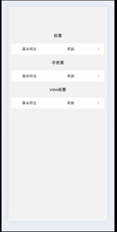

# wot-design-uni 嵌套弹窗时弹框会限定在父组件内

## 问题出现步骤

在 SwipeAction 中使用 SelectPicker 代码如下（完整代码地址会贴在文章底部），[效果](#effect)

``` ts
<template>
  <view class="px-3 py-20 text-center">
    <view @click.stop="closeOutside">
      <wd-swipe-action>
        <wd-select-picker v-model="value" label="基本用法" :columns="columns" @change="handleChange" />
        <template #right>
          <view class="action">
            <view class="button" style="background: #C8C7CD;" @click="handleAction('操作1')">
              操作1
            </view>
            <view class="button" style="background: #FFB300;" @click="handleAction('操作2')">
              操作2
            </view>
            <view class="button" style="background: #E2231A;" @click="handleAction('操作3')">
              操作3
            </view>
          </view>
        </template>
      </wd-swipe-action>
    </view>
  </view>
</template>
  ```

## 问题出现的原因
最开始猜测是 `SwipeAction` 包裹的问题，然后我使用了普通的 `view` 标签进行包裹发现是正常的[效果](#effect2)，然后我去看了一下`SelectPicker`的实现代码，发现内部使用了`ActionSheet`，然后`ActionSheet`使用了`Popup`，接着我去官方`github`的`issue`搜索了一下相关的问题，找到了[#900](https://github.com/Moonofweisheng/wot-design-uni/issues/900)，其中提到了popup嵌套的问题


## 解决方案


按照`issue`中说的方法对代码进行了调整。[查看](#effect3)

```ts
<template>
  <view class="px-3 text-center">
    <view class="my-20px">
      修改后代码
    </view>
    <view @click.stop="closeOutside">
      <wd-swipe-action>
        <wd-cell title="基本用法" value="内容" clickable @click="handleSelect" />
        <template #right>
          <view class="action">
            <view class="button" style="background: #C8C7CD;" @click="handleAction('操作1')">
              操作1
            </view>
            <view class="button" style="background: #FFB300;" @click="handleAction('操作2')">
              操作2
            </view>
            <view class="button" style="background: #E2231A;" @click="handleAction('操作3')">
              操作3
            </view>
          </view>
        </template>
      </wd-swipe-action>

      <wd-select-picker ref="select" v-model="value" label="基本用法" :columns="columns" use-default-slot @change="handleChange" />
    </view>
  </view>
</template>
```

完整版代码地址[wot-design-ui-demo](https://github.com/myltx/wot-design-ui-demo)

<a id="effect">效果1</a>


<a id="effect2">效果2</a>



<a id="effect3">效果3</a>


